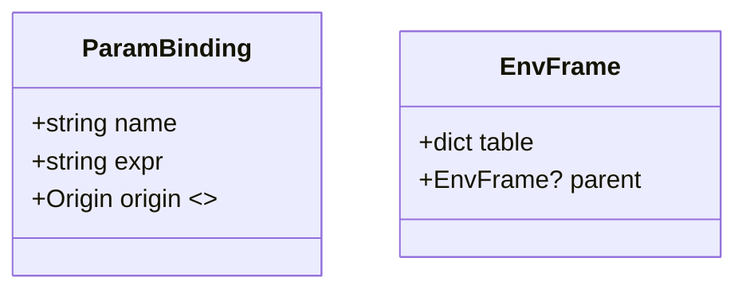

# ASDL Parameter System Implementation Plan

## 1. Objective

Implement a **compiler within the Cursor IDE** that converts an **ASDL YAML** design into a **ngspice-compatible netlist**, supporting `.param` semantics with scoping and precedence rules that exactly mirror ngspice behavior.

---

## 2. Scope

* **In-scope:**

  * Compilation from ASDL YAML to ngspice netlist
  * Global, module-local, and instance-level parameters
  * Derived parameters expressed as arithmetic expressions
  * Shadowing and downward propagation across nested subcircuits (≤10 levels)
  * Diagnostics for undefined or unused parameters
  * Netlist emission (`.param`, `.subckt … =default`, `X … PARAMS:`)
* **Out-of-scope (v1):**

  * Run-time adjustable parameters (behavioral sources)
  * Parametric sweeps (handled later via `.step`)

---

## 3. Functional Requirements

| ID   | Requirement                                                                       | Priority |
| ---- | --------------------------------------------------------------------------------- | -------- |
| FR-1 | Allow global parameters defined in ASDL YAML under `file_info.parameters`         | High     |
| FR-2 | Allow module-level formal parameters with defaults under `modules[*].params`      | High     |
| FR-3 | Support derived parameters in `modules[*].derived` section                        | High     |
| FR-4 | Permit instance-level parameter overrides in `instances[*].params`                | High     |
| FR-5 | Enforce ngspice precedence: **instance → local .param → formal default → global** | High     |
| FR-6 | Provide lint warnings for unused parameters                                       | Medium   |
| FR-7 | Error on unresolved parameter references                                          | High     |
| FR-8 | Support hierarchical modules with nesting ≥10                                     | Medium   |

---

## 4. Data Model



* **Origin** ∈ {GLOBAL, FORMAL\_DEFAULT, LOCAL\_DERIVED, INSTANCE\_OVERRIDE}
* Each `EnvFrame` represents one ASDL module instance.

---

## 5. Compiler Passes (Cursor Extension)

1. **YAML Loader Augmentation** – Load `file_info.parameters`, `modules[*].params`, `modules[*].derived`, and `instances[*].params`.
2. **Environment Stack Construction** – On AST traversal:

   * Build an `EnvFrame` for each module instance.
   * Merge parent frame for inherited parameters.
   * Apply overrides at instance call.
   * Add derived parameters in evaluation order.
3. **Expression Substitution** – Resolve `{param}` in all netlist expressions by looking up through the `EnvFrame` stack.
4. **Netlist Emission** –

   * Emit global `.param` block before all subcircuits.
   * Emit each `.subckt` with default parameters.
   * Emit local `.param` lines inside `.subckt` body.
   * Emit instance `X…` lines with `PARAMS:` overrides.
5. **Diagnostics** – Walk environment stack:

   * Flag unused parameters (defined but not referenced)
   * Error on unresolved `{param}` placeholders

---

## 6. Shadowing Algorithm (Pseudo-code)

```python
class EnvFrame:
    def resolve(self, name):
        if name in self.table:
            return self.table[name]
        elif self.parent:
            return self.parent.resolve(name)
        else:
            raise UnresolvedParam(name)
```

---

## 7. Cursor IDE Integration

* Implement as a **compiler backend** tool callable from a Cursor task or command.
* Add syntax highlighting for parameter references `{...}`.
* Provide diagnostics (unused, unresolved) in Cursor’s Problems panel.
* Optionally support real-time parameter evaluation previews in the IDE.

---

## 8. Testing Strategy

* **Unit tests**: YAML parsing, environment stack behavior
* **Golden netlist tests**: Diff compiled output against known ngspice decks
* **Simulation verification**: Batch simulate compiled decks in ngspice to verify DC/AC equivalence
* **Linting tests**: Include cases with unused and missing parameters to verify diagnostic messages

---

## 9. Milestones & Timeline

| Phase | Deliverable                     | ETA        |
| ----- | ------------------------------- | ---------- |
| 0     | Updated spec reviewed in Cursor | T0 + 1 wk  |
| 1     | YAML loader & data model        | T0 + 3 wks |
| 2     | Env stack + substitution engine | T0 + 5 wks |
| 3     | Netlist emission & diagnostics  | T0 + 7 wks |
| 4     | Cursor integration & tooling    | T0 + 8 wks |
| 5     | Test suite & examples           | T0 + 9 wks |

---

## 10. Risks & Mitigations

| Risk                                | Impact | Mitigation                                          |
| ----------------------------------- | ------ | --------------------------------------------------- |
| Circular param definitions          | High   | Detect cycles during Env Builder; raise error early |
| Parameter conflicts with net names  | Low    | Warn with namespace-aware diagnostics               |
| Large designs with deep hierarchies | Med    | Encourage modular reuse; issue depth warning        |

---

## 11. References

* **Ngspice User’s Manual 31.3** — *Parameter Handling*
* ASDL schema and language spec (2025-06-19)
* Cursor extension integration guide

---

*Prepared June 19 2025 — v0.2 for ASDL YAML-to-SPICE compiler in Cursor*
