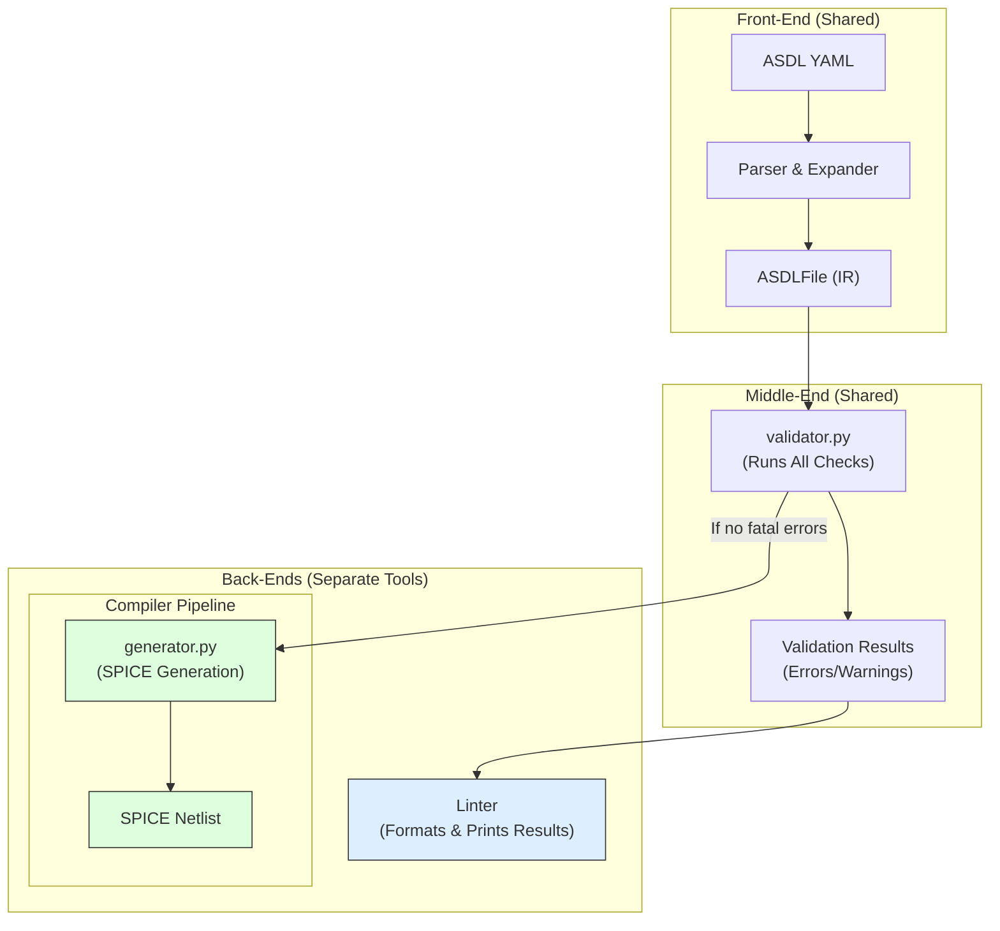
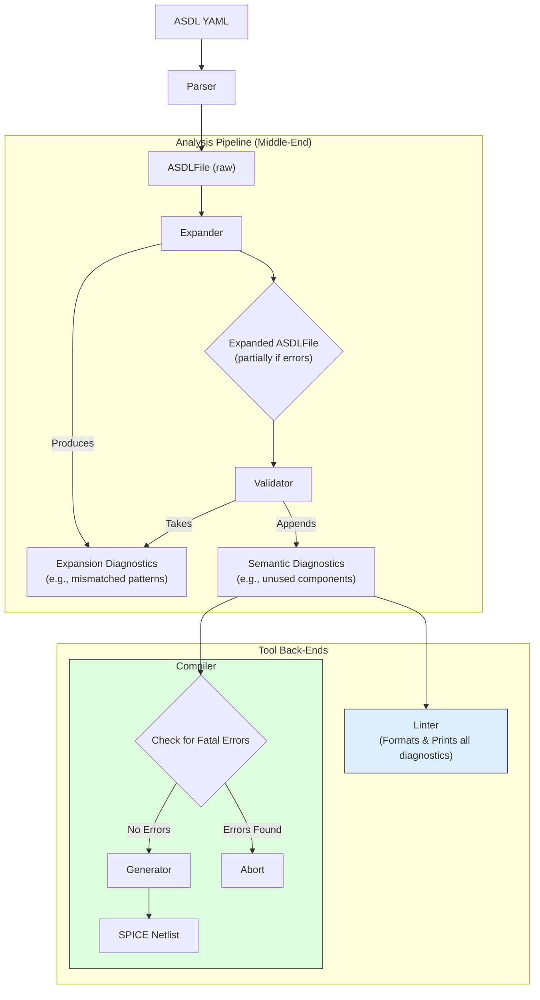

# ASDL Tooling Architecture: Linter and Compiler

This document outlines the architectural decisions for refactoring the ASDL tooling to support both a standalone linter and the existing ASDL-to-SPICE compiler, with a focus on maximizing code reuse.

## The Challenge

The goal is to create a new ASDL linter that can check for semantic and structural errors in ASDL YAML files. Much of the validation logic required for a linter (e.g., checking for undeclared nets, unused components) is already present or needed within the compiler pipeline. The challenge is to architect the project so that this logic is written once and shared between both tools.

## Initial Proposal: A Single Validation Stage

The initial idea was a classic three-stage compiler architecture:

1.  **Front-End (Shared):** `parser.py` and `expander.py` would parse and expand the ASDL source into an `ASDLFile` object (our Intermediate Representation or IR).
2.  **Middle-End (Shared):** A new `validator.py` module would run all semantic checks on the expanded `ASDLFile`.
3.  **Back-End (Specific):** The `linter` would report the validator's findings, while the `compiler` (`generator.py`) would use the validated `ASDLFile` to produce SPICE.

This led to the following architectural diagram:

## The Refinement: Handling Errors During Expansion

A key insight was raised: **What about errors that occur during the expansion phase itself?** For example, if a pattern has mismatched item counts (`G_<p,n>: in_p`). Under the initial proposal, the expander would likely crash with an exception, which is poor behavior for a linter that should report as many errors as possible in one go.

This led to a more sophisticated and robust architecture.

## Final Architecture: Multi-Stage Validation Pipeline

The final design treats validation as a continuous process that occurs throughout the analysis pipeline. Both the expander and a dedicated validator will generate diagnostic messages.

1.  **Front-End (Parsing):** The `parser` produces a raw `ASDLFile` object from the source YAML.

2.  **Middle-End (Analysis Pipeline):**
    *   **Stage 1: The Expander (`expander.py`)**: This stage now acts as the first analysis step. It attempts to expand patterns. Instead of raising exceptions on errors, it **logs them as diagnostic messages** and continues processing where possible. It outputs both the (potentially partially) expanded `ASDLFile` and a list of diagnostics.
    *   **Stage 2: The Validator (`validator.py`)**: This stage takes the expanded `ASDLFile` and the list of diagnostics from the previous stage. It runs its own semantic checks (e.g., unused components, net validation) on the successfully expanded parts of the design and **appends its findings** to the diagnostic list.

3.  **Back-End (Tool-Specific Consumers):**
    *   **Linter:** Runs the full analysis pipeline and then simply formats and prints the complete, combined list of diagnostics.
    *   **Compiler:** Runs the same analysis pipeline. It then inspects the list of diagnostics. If any fatal errors are present, it aborts. Otherwise, it proceeds to the `SPICEGenerator` to create the netlist.

This refined architecture is visualized below:

This final design is more robust, provides a better user experience for the linter, and maintains a clean separation of concerns. 