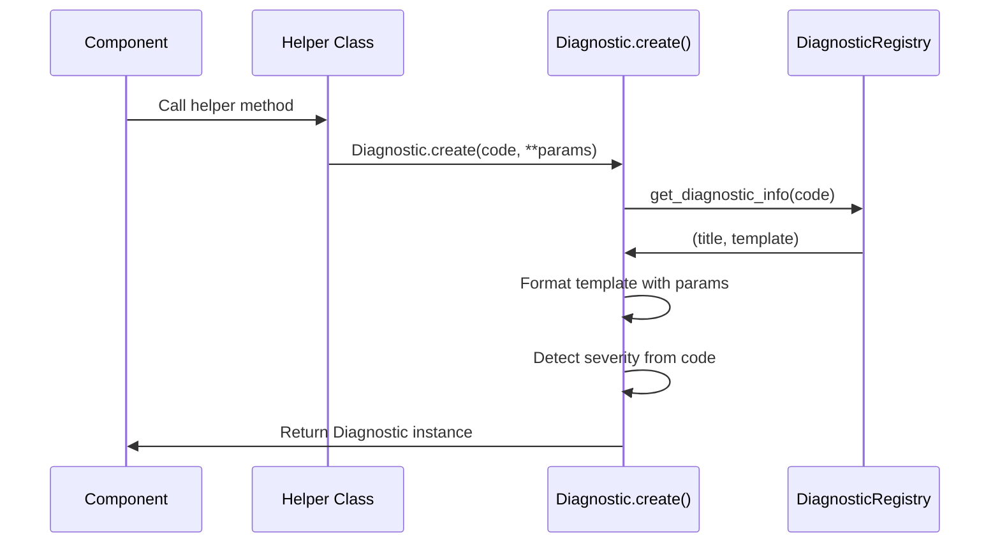
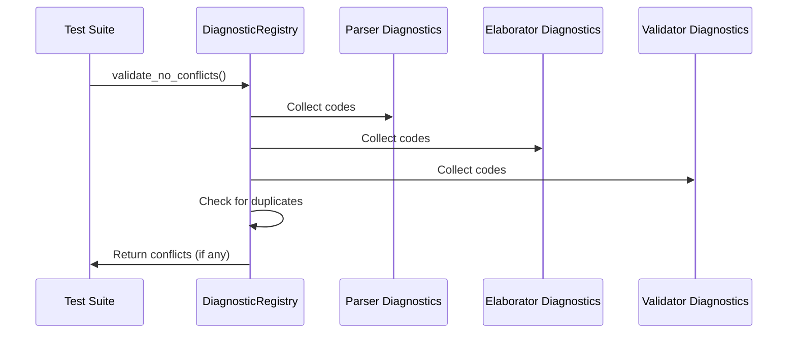

# XCCSS Diagnostic System Architecture

This document describes the technical architecture of the XCCSS diagnostic system, including component interactions, data flow, and integration patterns.

## System Overview

The XCCSS diagnostic system is built on a distributed architecture where each component manages its own diagnostic definitions while a central registry provides validation and tooling support.

```mermaid
graph TB
    subgraph "Component Diagnostics"
        PD[Parser Diagnostics<br/>PARSER_DIAGNOSTICS]
        ED[Elaborator Diagnostics<br/>ELABORATOR_DIAGNOSTICS]
        VD[Validator Diagnostics<br/>VALIDATOR_DIAGNOSTICS]
        GD[Generator Diagnostics<br/>GENERATOR_DIAGNOSTICS]
    end

    subgraph "Central Registry"
        DR[DiagnosticRegistry<br/>- Validation<br/>- Code Lookup<br/>- Tooling Support]
    end

    subgraph "Diagnostic Creation"
        DC[Diagnostic.create()<br/>- Template Processing<br/>- Severity Detection<br/>- Localization]
    end

    subgraph "Output Systems"
        CLI[CLI Tools<br/>- Compiler<br/>- Linter]
        LSP[Language Server<br/>- LSP Diagnostics<br/>- Code Actions<br/>- Quick Fixes]
        DOC[Documentation<br/>- Auto-generated<br/>- Examples<br/>- Migration Guides]
    end

    PD --> DR
    ED --> DR
    VD --> DR
    GD --> DR
    
    DR --> DC
    DC --> CLI
    DC --> LSP
    DR --> DOC

    style DR fill:#e1f5fe
    style DC fill:#f3e5f5
    style CLI fill:#e8f5e8
    style LSP fill:#fff3e0
```

## Component Structure

### 1. Component Diagnostic Definitions

Each component defines its diagnostics in a dedicated module following a consistent pattern:

```python
# src/asdl/{component}/diagnostics.py

# Diagnostic definitions dictionary
{COMPONENT}_DIAGNOSTICS = {
    "{CODE}": ("{TITLE}", "{TEMPLATE}"),
    # Examples:
    "P0201": ("Missing Required Section", "'{section}' is mandatory at top level"),
    "E0301": ("Pattern Count Mismatch", "Expected {expected} items, got {actual}"),
}

# Helper class for type-safe diagnostic creation
class {Component}Diagnostics:
    @staticmethod
    def specific_error(param: str, location: Locatable) -> Diagnostic:
        return Diagnostic.create("P0201", location=location, param=param)
```

#### Benefits of This Pattern:
- **Self-Contained**: Each component owns its diagnostic definitions
- **Type Safety**: Helper methods provide compile-time parameter checking
- **Consistency**: Standardized structure across all components
- **Discoverability**: Easy to find all diagnostics for a component

### 2. Central Diagnostic Registry

The registry provides system-wide services without creating dependencies:

```python
# src/asdl/diagnostics/registry.py

class DiagnosticRegistry:
    """Central registry for diagnostic validation and tooling"""
    
    # Aggregated view of all component diagnostics
    _all_diagnostics = {
        **PARSER_DIAGNOSTICS,
        **ELABORATOR_DIAGNOSTICS,
        **VALIDATOR_DIAGNOSTICS,
        **GENERATOR_DIAGNOSTICS,
    }
    
    @classmethod
    def validate_no_conflicts(cls) -> List[str]:
        """Validate no duplicate codes across components"""
        
    @classmethod
    def get_diagnostic_info(cls, code: str) -> Optional[Tuple[str, str]]:
        """Get (title, template) for a diagnostic code"""
        
    @classmethod
    def get_codes_by_category(cls, component: str, category: str) -> List[str]:
        """Get all codes for a specific category"""
```

#### Registry Responsibilities:
- **Conflict Detection**: Ensure no duplicate codes across components
- **Code Lookup**: Provide diagnostic information for tooling
- **Category Queries**: Support filtered code retrieval
- **Validation**: Development-time consistency checking

### 3. Enhanced Diagnostic Class

The core `Diagnostic` class provides rich functionality while maintaining simplicity:

```python
@dataclass
class Diagnostic:
    """Enhanced diagnostic with XCCSS support"""
    
    code: str                    # XCCSS format code
    title: str                   # Human-readable title
    details: str                 # Detailed description
    severity: DiagnosticSeverity # Auto-detected from code
    location: Optional[Locatable] = None
    suggestion: Optional[str] = None
    source: str = "asdl"
    
    # Language server extensions
    tags: List[DiagnosticTag] = field(default_factory=list)
    related_information: List[DiagnosticRelatedInformation] = field(default_factory=list)
    data: Optional[Any] = None
    
    @classmethod
    def create(cls, code: str, location: Optional[Locatable] = None, 
               suggestion: Optional[str] = None, **kwargs) -> 'Diagnostic':
        """Create diagnostic with template parameter substitution"""
        
        # Get diagnostic info from registry
        diagnostic_info = DiagnosticRegistry.get_diagnostic_info(code)
        if not diagnostic_info:
            raise ValueError(f"Unknown diagnostic code: {code}")
        
        title, template = diagnostic_info
        
        # Process template with provided parameters
        try:
            details = template.format(**kwargs) if kwargs else template
        except KeyError as e:
            raise ValueError(f"Missing template parameter {e} for diagnostic {code}")
        
        # Auto-detect severity from code category
        severity = cls._detect_severity(code)
        
        return cls(
            code=code,
            title=title,
            details=details,
            severity=severity,
            location=location,
            suggestion=suggestion
        )
    
    @staticmethod
    def _detect_severity(code: str) -> DiagnosticSeverity:
        """Auto-detect severity from XCCSS category"""
        if len(code) >= 3:
            category = code[1:3]  # Extract CC from XCCSS
            if category in ['01', '02', '03', '04', '05']:
                return DiagnosticSeverity.ERROR
            elif category in ['06', '07']:
                return DiagnosticSeverity.WARNING
            elif category in ['08']:
                return DiagnosticSeverity.INFO
        return DiagnosticSeverity.ERROR
```

## Data Flow Architecture

### 1. Diagnostic Creation Flow



### 2. Registry Validation Flow



## Integration Patterns

### 1. Language Server Integration

```python
# src/asdl/language_server/diagnostic_adapter.py

class LSPDiagnosticAdapter:
    """Converts ASDL diagnostics to Language Server Protocol format"""
    
    @staticmethod
    def to_lsp_diagnostic(diagnostic: Diagnostic, uri: str) -> LSPDiagnostic:
        """Convert ASDL Diagnostic to LSP Diagnostic"""
        return LSPDiagnostic(
            range=LSPRange(
                start=LSPPosition(
                    diagnostic.location.start_line - 1,
                    diagnostic.location.start_col - 1
                ),
                end=LSPPosition(
                    diagnostic.location.end_line - 1, 
                    diagnostic.location.end_col - 1
                )
            ),
            severity=_convert_severity(diagnostic.severity),
            code=diagnostic.code,
            source="asdl",
            message=f"{diagnostic.title}: {diagnostic.details}",
            tags=diagnostic.tags,
            related_information=diagnostic.related_information
        )
    
    @staticmethod
    def get_code_actions(diagnostic: Diagnostic, uri: str) -> List[CodeAction]:
        """Generate code actions based on diagnostic code"""
        # Implementation depends on specific diagnostic codes
        # P0601 (Dual Parameter Syntax) -> Quick fix to remove 'params'
        # P0701 (Unknown Section) -> Quick fix to remove or rename section
```

### 2. CLI Tool Integration

```python
# src/asdl/cli/diagnostic_formatter.py

class CLIDiagnosticFormatter:
    """Formats diagnostics for command-line output"""
    
    @staticmethod
    def format_diagnostic(diagnostic: Diagnostic) -> str:
        """Format single diagnostic for CLI display"""
        severity_icon = {
            DiagnosticSeverity.ERROR: "❌",
            DiagnosticSeverity.WARNING: "⚠️ ",
            DiagnosticSeverity.INFO: "ℹ️ "
        }
        
        location = f" at {diagnostic.location}" if diagnostic.location else ""
        
        return (
            f"{severity_icon.get(diagnostic.severity, '')} "
            f"{diagnostic.code}: {diagnostic.title}{location}\n"
            f"   {diagnostic.details}"
        )
    
    @staticmethod
    def format_summary(diagnostics: List[Diagnostic]) -> str:
        """Format diagnostic summary"""
        errors = sum(1 for d in diagnostics if d.severity == DiagnosticSeverity.ERROR)
        warnings = sum(1 for d in diagnostics if d.severity == DiagnosticSeverity.WARNING)
        
        return f"Found {errors} error(s) and {warnings} warning(s)"
```

## Testing Strategy

### 1. Registry Validation Tests

```python
# tests/test_diagnostic_registry.py

def test_no_duplicate_codes():
    """Ensure no diagnostic codes conflict across components"""
    conflicts = DiagnosticRegistry.validate_no_conflicts()
    assert not conflicts, f"Duplicate diagnostic codes found: {conflicts}"

def test_all_codes_have_definitions():
    """Ensure all referenced codes have definitions"""
    for component in ["parser", "elaborator", "validator"]:
        helper_module = importlib.import_module(f"asdl.{component}.diagnostics")
        # Verify all codes used in helper methods are defined
```

### 2. Diagnostic Creation Tests

```python
# tests/test_diagnostic_creation.py

def test_diagnostic_template_processing():
    """Test template parameter substitution"""
    diagnostic = Diagnostic.create(
        "P0201", 
        location=test_location,
        section="file_info"
    )
    assert "file_info" in diagnostic.details
    assert diagnostic.code == "P0201"
    assert diagnostic.severity == DiagnosticSeverity.ERROR

def test_missing_template_parameter():
    """Test error handling for missing template parameters"""
    with pytest.raises(ValueError, match="Missing template parameter"):
        Diagnostic.create("P0201", location=test_location)
        # Missing required 'section' parameter
```

## Performance Considerations

### 1. Registry Lookup Optimization

- **Lazy Loading**: Registry builds diagnostic map only when first accessed
- **Caching**: Template processing results cached for repeated diagnostics
- **Batch Validation**: Conflict checking performed only during tests/CI

### 2. Memory Usage

- **Shared Templates**: Diagnostic templates stored once, referenced by instances
- **Minimal Overhead**: XCCSS system adds minimal memory footprint
- **Efficient Serialization**: LSP conversion optimized for network transfer

## Migration Support

### 1. Backward Compatibility

```python
# Temporary compatibility layer during migration
LEGACY_CODE_MAPPING = {
    "P100": "P0101",  # Invalid YAML Syntax
    "P101": "P0102",  # Invalid Root Type
    "P102": "P0201",  # Missing Required Section
    # ... complete mapping
}

class LegacyDiagnosticAdapter:
    @staticmethod
    def convert_legacy_code(old_code: str) -> str:
        """Convert legacy code to XCCSS format"""
        return LEGACY_CODE_MAPPING.get(old_code, old_code)
```

### 2. Documentation Generation

```python
# tools/generate_diagnostic_docs.py

def generate_diagnostic_documentation():
    """Generate markdown documentation from diagnostic definitions"""
    for component_name, diagnostics in all_component_diagnostics.items():
        # Generate component-specific documentation
        # Include examples, suggestions, migration notes
```

This architecture provides a solid foundation for current needs while positioning the system for future enhancements including full language server development.